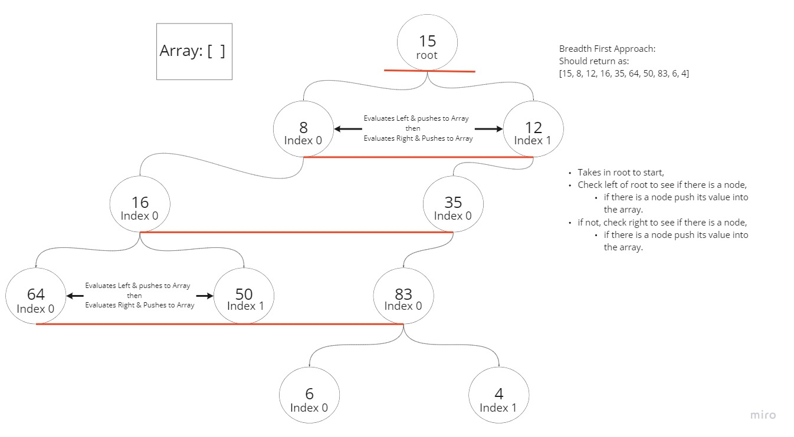

# Challenge Summary

## Feature Tasks

- Node
  - Create a Node class that has properties for the value stored in the node, the left child node, and the right child node.

- Binary Tree
  - Create a Binary Tree class
  - Define a method for each of the depth first traversals:
    - pre order
    - in order
    - post order which returns an array of the values, ordered appropriately.

      - Any exceptions or errors that come from your code should be semantic, capture-able errors. For example, rather than a default error thrown by your language, your code should raise/throw a custom, semantic error that describes what went wrong in calling the methods you wrote for this lab.

- Binary Search Tree
  - Create a Binary Search Tree class
  - This class should be a sub-class (or your languages equivalent) of the Binary Tree Class, with the following additional methods:
    - Add
      - Arguments: value
      - Return: nothing
    - Adds a new node with that value in the correct location in the binary search tree.
    - Contains:
      - Argument: value
      - Returns: boolean indicating whether or not the value is in the tree at least once.

- Write the following method for the Binary Tree class

  - find maximum value
    - Arguments: none
    - Returns: number
  - Find the maximum value stored in the tree. You can assume that the values stored in the Binary Tree will be numeric.

- Write a function called breadth first
  - Arguments: tree
  - Return: list of all values in the tree, in the order they were encountered
    - NOTE: Traverse the input tree using a Breadth-first approach

## Structure and Testing

- Utilize the Single-responsibility principle: any methods you write should be clean, reusable, abstract component parts to the whole challenge. You will be given feedback and marked down if you attempt to define a large, complex algorithm in one function definition.

- Write tests to prove the following functionality:
  - Binary Tree/ Binary Tree Search:
    - Can successfully instantiate an empty tree
    - Can successfully instantiate a tree with a single root node
    - Can successfully add a left child and right child to a single root node
    - Can successfully return a collection from a preorder traversal
    - Can successfully return a collection from an inorder traversal
    - Can successfully return a collection from a postorder traversal
    - Can successfully find a Max Value
    - Can successfully find a Min Value

  - K-ary Tree:
    - Return an array of node values that conform to the breadth first construction

    
    
    Contributions(Stefanie Riehle, Alex Grazda)
